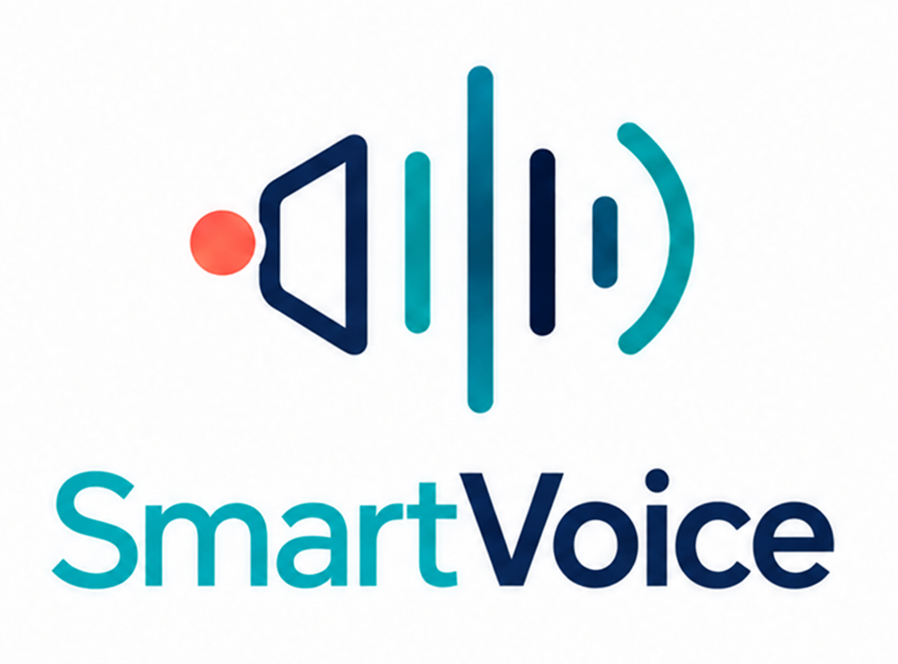

<div align="center">
  
  <p><strong>Local speech recognition and synthesis, with language-aware model routing.</strong></p>
  <p>Multilingual STT and TTS · CPU inference · OpenAPI · No per-request API fee</p>
</div>

# SmartVoice

SmartVoice is a local speech-to-text (STT) and text-to-speech (TTS) service. It offers both through one OpenAI-style audio API, with models installed and run on your machine.

## Why SmartVoice?

- **One local service for speech:** Transcribe audio and synthesize speech through the same API, without sending media to a cloud provider.
- **Choose models by language automatically:** Use SmartVoice's virtual model IDs to route each request to an installed model configured for that language.
- **Works offline after setup:** Install model files once, then run inference locally on CPU with no per-request API fee.

## Smart routing

Smart routing selects a model for each request using its language and a user-editable, ordered JSON table. It is a lightweight model router: the configured order decides which model is preferred for each task and language.

Use one virtual model ID for both transcription and speech synthesis. SmartVoice routes by the API endpoint being called:

| Request | Virtual model ID | Language source |
|---|---|---|
| Transcription | `smartvoice-auto` | Explicit `language`, or automatic detection when omitted or `auto` |
| Speech synthesis | `smartvoice-auto` | Explicit `language`, or text detection when omitted or `auto` |

The built-in route table is copied to `<data_dir>/router.json` on first startup. Edit the JSON file to customize model selection by language, then apply the changes without restarting:

```bash
python -m smartvoice router reload
```

Choose a virtual model ID to use language-aware routing, or specify a concrete model ID to invoke that model directly. See the [API specification](doc/api-spec.md) for request details.

## Capabilities

| Area | Current support |
|---|---|
| Platforms | Windows x64 and macOS Apple Silicon, run from source |
| Inference | sherpa-onnx and optional Qwen3-TTS PyTorch adapter, CPU only |
| STT | Whisper Base multilingual, SenseVoice Small, Qwen3-ASR 0.6B |
| TTS | Kokoro 1.1, Matcha Baker, Supertonic 3, Qwen3-TTS 0.6B |
| API | OpenAPI docs, transcription, speech synthesis, model catalog and runtime status |
| Model management | Install, uninstall, offline import/export, and resumable downloads |
| Not yet supported | GPU inference, streaming, Linux/Android, remote access, packaged installers, MCP |

SmartVoice supports a subset of OpenAI Audio API conventions; this is not a claim of full API compatibility. See the [API specification](doc/api-spec.md) for request and response details.

## Model catalog

Models use the inference adapter identified in the catalog. Language availability describes catalog capability, not comparative quality; model and voice licenses may differ from SmartVoice's license. Based on available quality and performance benchmarks, the recommended STT models are SenseVoice and Qwen3-ASR. For Chinese TTS, Matcha Baker and Kokoro are the lightweight choices; Qwen3-TTS is an optional multilingual alternative with a larger download and separate runtime dependencies. Supertonic 3 does not support Chinese. Benchmark coverage varies by language, and TTS listening quality has not been rated with MOS.

| Model ID | Task | Languages / voices | Recommendation |
|---|---|---|---|
| `stt-whisper-base-multilingual-int8` | STT | Auto detection; English, Chinese, Japanese, Korean, French, German | — |
| `stt-sensevoice-small-int8` | STT | Chinese, English, Cantonese, Japanese, Korean | Recommended |
| `stt-qwen3-asr-600m-int8` | STT | 30 language codes including Cantonese; automatic detection | Recommended |
| `tts-kokoro-multilingual-v1-1-zh-en` | TTS | Chinese, English; 103 speakers | — |
| `tts-matcha-zh-baker` | TTS | Chinese; one voice | Recommended for Chinese only |
| `tts-supertonic-v3-multilingual-int8` | TTS | 31 languages; no Chinese | Recommended for its supported languages |
| `tts-qwen3-0-6b-customvoice` | TTS | 10 languages; 9 preset voices | — |

Qwen3-ASR needs about 1 GB for model files. Qwen3-TTS 0.6B needs about 2.5 GB for model files and at least 6 GiB free disk space during installation. See [`catalog/models.json`](catalog/models.json) for the exact language codes, sources, and model details.

Melo TTS has been removed from the supported catalog, and Supertonic 3 does not support Chinese. Existing model files are left on disk. If an older `<data_dir>/router.json` references the removed Melo model or routes Supertonic for Chinese, SmartVoice rejects that saved routing table, uses the built-in router, and reports a warning. Remove those stale entries and run `python -m smartvoice router reload` to clear the warning.

For routed STT requests with `language=auto`, SmartVoice can use an optional dedicated spoken-language detector. Install it explicitly with `python -m smartvoice models install-language-id`; without it, SmartVoice falls back to an installed STT model that supports automatic language detection. The detector is not downloaded during service startup. Its availability is reported by `/v1/capabilities`.

## Quick start (macOS and Windows)

### Start SmartVoice

Requires Python 3.11 or newer. SmartVoice runs inference on CPU; no GPU or CUDA installation is required. The examples use the default loopback address, `127.0.0.1`.

After the first PyPI release, install the published package and inference dependencies with:

```bash
python -m pip install "smartvoice[inference]"
python -m smartvoice models install stt-sensevoice-small-int8
python -m smartvoice models install tts-kokoro-multilingual-v1-1-zh-en
python -m smartvoice --host 127.0.0.1 --port 8000
```

To add Qwen3-TTS, install the optional runtime dependencies and model before starting SmartVoice:

```bash
python -m pip install "smartvoice[inference,qwen-tts]"
python -m smartvoice models install tts-qwen3-0-6b-customvoice
```

Upgrade an existing installation with `python -m pip install --upgrade "smartvoice[inference]"`. The package includes the built-in model catalog, router table, web page, and default `smartvoice.json`; model weights are downloaded separately.

To run from a source checkout, use the development install below. On macOS:

```bash
python3 -m venv .venv
source .venv/bin/activate
python -m pip install -e ".[inference]"
python -m smartvoice models install stt-sensevoice-small-int8
python -m smartvoice models install tts-kokoro-multilingual-v1-1-zh-en
python -m smartvoice --host 127.0.0.1 --port 8000
```

To run Qwen3-TTS from a source checkout, install both extras with `python -m pip install -e ".[inference,qwen-tts]"`, then install `tts-qwen3-0-6b-customvoice` from the model catalog.

On Windows x64, use PowerShell:

```powershell
py -3.11 -m venv .venv
.\.venv\Scripts\python.exe -m pip install -e ".[inference]"
.\.venv\Scripts\python.exe -m smartvoice models install stt-sensevoice-small-int8
.\.venv\Scripts\python.exe -m smartvoice models install tts-kokoro-multilingual-v1-1-zh-en
# Optional multilingual models
.\.venv\Scripts\python.exe -m smartvoice models install stt-qwen3-asr-600m-int8
.\.venv\Scripts\python.exe -m smartvoice models install tts-supertonic-v3-multilingual-int8
# Optional Qwen3-TTS runtime (installs additional Python dependencies)
.\.venv\Scripts\python.exe -m pip install -e ".[inference,qwen-tts]"
# Then install tts-qwen3-0-6b-customvoice from the model catalog
.\.venv\Scripts\python.exe -m smartvoice --host 127.0.0.1 --port 8000
```

The first model installation requires internet access. Model files are kept outside the source checkout: by default in `~/Library/Application Support/SmartVoice` on macOS or `%LOCALAPPDATA%\SmartVoice` on Windows. Set `SMARTVOICE_HOME` to use another data directory. Once installed, models run locally.

On first service startup, SmartVoice creates `<data_dir>/smartvoice.json` with default settings. Edit it to change the service port, resource limits, or other settings; later starts read it automatically. The repository's [`config/smartvoice.example.json`](config/smartvoice.example.json) shows the available options. You can use `--config <path>` or `SMARTVOICE_CONFIG` to select a separate settings file. Environment variables override values from JSON.

The route table is separate: edit `<data_dir>/router.json`, then run `python -m smartvoice router reload`. The server binds to loopback by default; remote/LAN access is not supported in this release.

### Connect an agent or application

Before connecting a client, open the built-in SmartVoice integration test page at `http://127.0.0.1:8000/test`. It lists installed STT and TTS models with their supported languages and sizes, lets you upload audio for a real transcription test, and generates playable speech from text. Use it to confirm the models and languages you need are available; the page also shows copyable `curl` examples with the selected model IDs.

In your OpenAI-compatible client, set the API base URL to:

```text
http://127.0.0.1:8000/v1
```

Open [http://127.0.0.1:8000/docs](http://127.0.0.1:8000/docs) for interactive API documentation.

## API

The audio endpoints follow a supported subset of the OpenAI Audio API conventions. For request fields, response formats, and errors, see the [API specification](doc/api-spec.md).

### Transcribe audio with routing

```powershell
curl.exe -F "file=@sample.wav" -F "model=smartvoice-auto" -F "language=auto" `
  http://127.0.0.1:8000/v1/audio/transcriptions
```

Supported upload formats include WAV, MP3, M4A, and FLAC. Audio is limited to 25 MiB and 10 minutes by default.

### Synthesize speech with routing

```powershell
curl.exe -X POST http://127.0.0.1:8000/v1/audio/speech `
  -H "Content-Type: application/json" `
  -d '{"model":"smartvoice-auto","input":"Hello from SmartVoice.","language":"auto"}' `
  --output speech.wav
```

TTS returns mono WAV audio. Requests support up to 4,000 characters; generated audio is limited to 180 seconds or 32 MiB by default. See `/docs` or the [API specification](doc/api-spec.md) for available parameters, language behavior, and error codes.

## Manage models

The CLI supports `models list`, `install`, `uninstall`, `export`, and `import`. Models can also be installed through API download jobs. Exported model packages can be transferred to offline machines and imported there. An installed model cannot be uninstalled while the service is using it.

Install a model with `python -m smartvoice models install <model-id>`. By default, SmartVoice uses the model's catalog source. For Hugging Face models, pass `--source` with a compatible mirror base URL to use another source, such as:

```bash
python -m smartvoice models install stt-qwen3-asr-600m-int8 --source https://hf-mirror.com
```

The base URL is combined with the catalog-pinned repository, revision, and file paths. This option is available only when all required model files are hosted on Hugging Face. Downloaded files are still checked against their catalog SHA-256 values.

```bash
python -m smartvoice models list
python -m smartvoice models export stt-sensevoice-small-int8 ./sensevoice.smartvoice.zip
python -m smartvoice models import ./sensevoice.smartvoice.zip
python -m smartvoice models uninstall stt-sensevoice-small-int8
```

## Architecture

```text
Client / Agent ──► Versioned HTTP API ──► Application services
                         ▲                       │
                         │                       ▼
                    Local CLI              Domain contracts
                                                 │
                               ┌─────────────────┴─────────────────┐
                               ▼                                   ▼
                       Inference port                      Model repository port
                               │                                   │
                               ▼                                   ▼
                    Composite inference provider       Filesystem catalog adapter
                       ┌───────┴────────┐
                       ▼                ▼
                sherpa-onnx       optional Qwen-TTS
                   adapter            adapter
                       │
                       ▼
              Platform diagnostics adapter
```

Callers use versioned API and capability endpoints; inference details stay behind provider and repository interfaces. The current source deployment supports CPU inference on Windows x64 and macOS Apple Silicon. Qwen3-TTS is an optional backend and requires the separate `[qwen-tts]` extra. GPU providers, streaming, Linux and Android runtimes are not available.

## Development

```bash
python -m pip install -e ".[inference,dev]"
python scripts/test.py ci
```

Run `python scripts/test.py regression` to execute the full functional suite including real STT/TTS inference. It requires the `stt-sensevoice-small-int8` and `tts-kokoro-multilingual-v1-1-zh-en` models to be installed. See [`doc/testing.md`](doc/testing.md) for prerequisites and details. See [`benchmarks/README.md`](benchmarks/README.md) for model quality, latency, and concurrency comparisons.
See [`doc/releasing.md`](doc/releasing.md) for versioning, GitHub Releases, and optional PyPI publishing.

## Repository layout

```text
catalog/       Model metadata and default router table
src/           API/CLI entry points, application services, domain contracts, ports, and adapters
tests/         Unit, API, and optional real-inference tests
benchmarks/    Benchmark code, configurations, and results
config/        Example service settings
doc/           API specification, testing, release, requirements, and design notes
assets/        Project logo
```

## License

SmartVoice source code is licensed under the [Apache License 2.0](LICENSE). Model weights, voices, and other third-party assets may have separate license terms; review them before use or redistribution.
