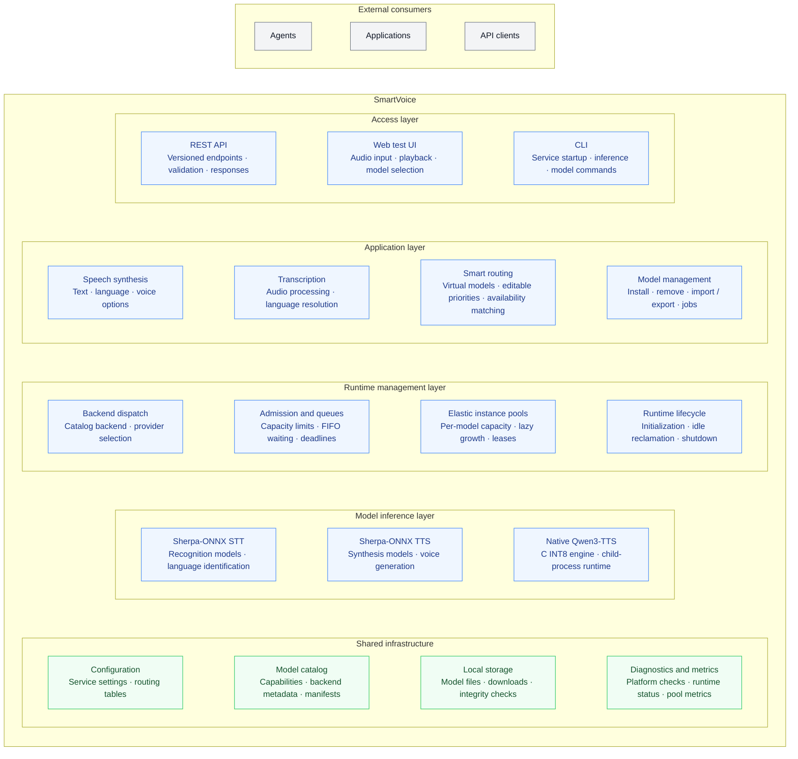

# SmartVoice Architecture Summary and Guidelines

This document has two parts. Part I defines the architecture principles that constrain design and implementation choices. Part II records the current architecture and platform compatibility as an implementation snapshot; it must be updated when the code or supported build paths change.

## Part I — Architecture Guidelines

### 1. Purpose

This document provides shared architectural guidance for future SmartVoice features, bug fixes, and platform extensions. It describes how responsibilities should be separated, how parts of the system should collaborate, and what reviewers should check.

The current implementation is summarized in Part II. For a concrete design problem, use the principles in this first part to define the boundaries before choosing an implementation.

### 2. Architecture Goals

SmartVoice should continue to meet these goals:

- Provide stable, clear, versioned contracts for speech capabilities.
- Keep recognition, synthesis, and model management independent of any particular inference framework, operating system, or hardware vendor.
- Keep clients independent of model files, inference engine internals, and platform details.
- Maintain predictable resource use and behavior for lightweight, local, privacy-focused use cases.
- Allow new models, backends, and platforms without rewriting business rules or clients.

Layering exists to control dependencies and limit the scope of change. Do not add indirection merely to increase the number of layers, patterns, or abstractions.

### 3. Core Principles

#### 3.1 Contracts First: Decouple Callers from Implementations

APIs, the CLI, desktop clients, and automation clients should depend on stable public contracts. Backends, models, and internal strategies may change. Change a public contract only when product capabilities or caller-visible semantics intentionally change, and document versioning and compatibility impact.

Public contracts must define input limits, output meaning, error semantics, optional capabilities, and compatibility rules. Callers must not infer behavior from backend names, model filenames, or undocumented conventions.

#### 3.2 Dependencies Point Toward Stable Rules

Business rules and domain concepts should be independent of network frameworks, file formats, operating system APIs, inference libraries, and specific models. External technologies participate in business flows through explicit interfaces; replacing a technology should not force domain rules to be rewritten.

Dependencies should converge on stable business concepts. Lower-level components must not depend on higher-level orchestration. Collaboration across boundaries should use interfaces and data contracts with clear semantics.

#### 3.3 Clear Responsibilities and No Boundary Leakage

Separate responsibilities by reason for change:

- External interfaces parse protocols, validate input, and map responses.
- Application flows coordinate a complete business operation and its call sequence.
- Domain rules define model, language, capability, routing, and lifecycle constraints.
- Adapters connect inference runtimes, storage, platform resources, and external services.

Pass clear, stable, framework-independent data across boundaries. Do not allow HTTP request objects, inference library objects, file path conventions, or vendor-specific parameters to spread across layers.

#### 3.4 Interfaces Describe Business Capabilities, Not Technology Details

An abstract interface should express the capability and result that its caller needs, such as running recognition, reporting available capabilities, finding an installed model, or safely removing a model. Do not merely copy a third-party library's function signature into the project.

Keep interfaces small and focused, with explicit error and cancellation behavior. Boundaries that need multiple implementations should be replaceable and testable. Do not add interfaces mechanically when there is only one implementation and no real isolation need.

#### 3.5 Use Capability Negotiation to Support Extension

Model and runtime capabilities should be explicit, including tasks, languages, formats, device requirements, optional features, and limitations. Callers should use capability information to decide what is available. The system must not infer capabilities from model names, backend types, or what is "usually supported."

Integrate new models and backends through capability descriptions and compatibility validation. Do not scatter model-specific conditions across APIs, application flows, and clients.

The domain and application core must remain model-agnostic: do not branch on a model ID, model name, model family, or provider-specific runtime detail in shared business flows. Put model-specific preprocessing, initialization, decoding, and output handling inside the model adapter. Describe caller-relevant differences through the stable capability contract or validated model configuration, so shared flows can apply generic rules without knowing which model supplied a capability. Adding or replacing a model should normally require changes to its adapter, catalog or capability data, and focused tests—not special cases in shared orchestration. Before adding a model-specific condition, check whether the adapter or a declared capability can own it.

#### 3.6 Make Configuration-Driven Behavior Explainable

Represent changeable policies, such as routing, model catalogs, and runtime limits, as validated data or configuration. The system should be able to report the active configuration, the model or device actually selected, and why a capability is unavailable.

Configuration loading and hot reload need explicit validation, failure, and fallback semantics. Invalid configuration must not produce unpredictable behavior silently. If an update fails, keep the last known-good state and provide diagnostic information.

#### 3.7 Failures, Cancellation, and Resource Limits Are Part of the Contract

Speech operations may encounter invalid input, missing capabilities, uninstalled models, insufficient resources, queue timeouts, execution failures, or client cancellation. Each case needs clear and consistent caller-visible semantics, mapped at the boundary into understandable information.

Bound task queues, audio buffers, model loading, and generated output. Define resource cleanup for timeouts, cancellation, and disconnected clients. Unbounded waiting and buffering must not be the default.

#### 3.8 Local Operation and Privacy Are Defaults

Inference with installed models should work without a network connection. Service startup must not make unnecessary network requests silently. Installation of optional resources must require an explicit action and report their source, integrity checks, and failure reasons.

Expose only the local interfaces that are needed by default. Logs and diagnostics must not record raw audio, transcription text, synthesis text, or credentials unless the user explicitly enables bounded debugging. Restrict temporary data to a limited scope and clean it up promptly.

#### 3.9 Keep Platform and Hardware Differences at Adapter Boundaries

Differences in operating systems, CPUs/GPUs, audio codecs, and native runtimes belong in the corresponding adapters. Business logic should depend on unified capabilities and results, not platform checks or device-vendor branches.

Validate capability availability, fallback behavior, actual execution device, and resource use separately for each new platform or accelerator. Support by a backend for one device does not prove that all models or platforms support it.

#### 3.10 Back Lightweight and Performance Claims with Evidence

Model parameter count, file format, and hardware specifications alone do not prove that the user experience is acceptable. Decisions about lightweight operation, real-time performance, concurrency, or low resource use should be based on target-device measurements of installation size, cold start, latency, real-time factor, memory, and relevant quality metrics.

Concurrency settings, caching strategies, and model selection must respect the runtime's thread-safety and resource model. Measure bottlenecks and state test conditions before changing throughput-related settings.

### 4. Change and Evolution Requirements

#### 4.1 Adding Capabilities

Before adding a speech task, model parameter, language, or output format, answer these questions:

1. Is this a public capability, application flow, domain rule, or external technology adaptation?
2. Which callers need to know about it? Does it require a versioned contract?
3. How will the capability be queried, validated, and reported as unavailable?
4. Which platform, model, and runtime combinations are verified, and which are only candidates?
5. How are failures, timeouts, cancellation, and resource limits defined?

#### 4.2 Replacing a Backend or Adding a Platform

When replacing an inference runtime or adding a platform, prefer adding or replacing a boundary implementation. If the public contract or business rules must change, explain why the external capability has changed. If only the underlying library differs, translate that difference in the adapter.

#### 4.3 Configuration and Data Format Changes

Configuration and persisted data are user assets. When their structure changes, define compatible reads, migration, backup, and failure recovery. Never overwrite user configuration silently at startup. Define a clear merge rule for updated defaults and user-customized values.

#### 4.4 Dependencies and Resources

Third-party dependencies, models, and built-in resources need clear source, version or revision, license, and integrity information. Distributions must include required non-model resources and be verified in a clean environment. Document model-weight distribution separately from application-code distribution.

### 5. Development and Review Checklist

At minimum, design and code reviews should check:

- Is new logic in the right responsibility boundary? Are dependency directions stable?
- Are backend, model, operating system, or HTTP framework details leaking into layers that do not need them?
- Do domain and application flows avoid branching on individual model IDs, names, or families? Are model-specific behaviors contained in adapters or expressed as declared capabilities/configuration?
- Does a new interface solve a real replacement or isolation need, and is it small and clear?
- Are changes to external behavior, errors, capabilities, and configuration documented with compatibility notes?
- Are unavailability, failures, timeouts, cancellation, overload, and resource cleanup covered?
- Does the change avoid unexpected network access at startup, sensitive logging, and unbounded resource use?
- Were packaged resources, configuration loading, platform support, and critical runtime paths checked in the target environment?
- Do tests verify cross-boundary contracts and user-visible behavior rather than only implementation details?

If one change requires multiple unrelated layers to understand the same backend detail, the abstraction boundary is probably unclear. Identify which boundary should own that knowledge before spreading more conditions.

### 6. Practices to Avoid

- Letting API routes operate directly on inference objects, model files, or platform APIs.
- Hiding business rules in controllers, model adapters, configuration parsers, or the UI.
- Making core logic depend on a particular inference framework's objects, exceptions, or naming conventions.
- Guessing capabilities from strings or hiding missing capabilities behind implicit defaults.
- Maintaining the same model capabilities, language lists, or routing rules in multiple places.
- Designing large abstractions or plugin systems for hypothetical callers that do not exist.
- Merging responsibilities with different reasons for change to reduce line count, or introducing cross-layer circular dependencies.
- Increasing concurrency, loosening resource limits, or marking an unverified model as recommended without evidence.
- Rewriting user configuration or local model state without migration and backup plans.

### 7. Architecture Quality Criteria

Common changes should stay localized: replacing an inference backend should not require rewriting clients; adding a language should not require duplicating conditions across modules; adding a platform should not require rewriting domain rules; changing API representation should not require changing model loading; and replacing file storage should not change speech workflows.

These criteria are goals, not a claim that every change can remain fully local. If a change affects multiple boundaries, explain the source of coupling, compatibility impact, and validation scope.

## Part II — Current Architecture and Platform Compatibility

**Implementation snapshot last reviewed:** 2026-10-04

### Functional Layered Architecture

The architecture is organized into layers by responsibility. Components shown
on the same row belong to the same functional layer. External agents and
applications sit above the SmartVoice boundary; the product layers separate
access, application capabilities, runtime management, and model inference.

The vertical arrangement expresses architectural layers. Shared infrastructure
supports all product layers. Smart routing belongs to the application layer,
while admission, instance pools, and runtime lifecycle belong to runtime
management. Backend-specific native execution belongs to model inference.
The Sherpa STT and TTS boxes group capabilities of the same backend adapter;
they do not represent separate public backends. The diagram uses invisible
layout links to align boxes and has no request-flow arrows.

`app.create_app()` composes the API, services, settings, model repository, and
inference providers. The CLI shares the application services and provider
factory. Smart routing selects a model from the editable routing table using
task, language, and installed-model availability. Backend adapters keep native
runtime details behind provider interfaces. Configuration and catalog files
are local to the SmartVoice data directory; model weights are installed
separately from the Python package.

#### Inference concurrency, lifecycle, and limits

SmartVoice manages request admission and runtime instance lifecycle around the
existing inference adapters. Sherpa native code, model constructors, internal
safety locks, generation parameters, and output formats remain unchanged. Each
supported Sherpa model has an independent lazy pool of adapter instances. Qwen
uses one shared backend runtime and does not gain native batching or multiple
runtime processes from this pool design.

| Setting | Default | Effect |
|---|---:|---|
| `min_instances` | 1 | Keep at least this many already-created instances warm per used model; models are not loaded at startup. |
| `max_instances` | 2 | Maximum independent adapter instances per Sherpa model. |
| `model_availability_ttl_seconds` | 600 | Refresh the process-wide installed-model snapshot in the background after this many seconds. |
| `instance_idle_seconds` | 300 | Reclaim idle extra instances after this interval. |
| `num_threads` | 2 (bounded by available CPU count) | Native constructor thread count for each instance; fixed for the app lifetime. |
| `max_queued_inference` | 4 | Maximum requests waiting per model for an adapter instance. |
| `max_concurrent_inference` | 1 | `1` enables managed parallel inference; `0` forces one global inference slot. Only 0 and 1 are accepted. |

These settings can be supplied in `smartvoice.json` or with the matching
`SMARTVOICE_MIN_INSTANCES`, `SMARTVOICE_MAX_INSTANCES`,
`SMARTVOICE_INSTANCE_IDLE_SECONDS`, `SMARTVOICE_NUM_THREADS`,
`SMARTVOICE_MAX_QUEUED_INFERENCE`, and
`SMARTVOICE_MAX_CONCURRENT_INFERENCE` environment variables. The TTL setting
also accepts `SMARTVOICE_MODEL_AVAILABILITY_TTL_SECONDS`. Environment
values override JSON. Existing settings files are not rewritten. Queue wait
and execution deadlines are configured separately with
`inference_queue_timeout_seconds` and
`inference_execution_timeout_seconds`.

The first request lazily creates and warms an instance. Further demand may
create instances up to the per-model maximum; waiters are served FIFO. The
minimum is a retention floor for instances demand has created, not a preload
count. There is no batch accumulation. TTS language, voice, speed, and text do
not create separate pools. ASR language-specific native sessions remain cached
inside each adapter and can add memory beyond the number of adapter instances.
The optional language detector has its own pool. Limits apply per application
process, so multiple server processes each have independent capacity.

When `max_concurrent_inference=1` and the selected provider advertises managed
admission, the outer HTTP queue is bounded to the aggregate provider capacity
(model slots plus bounded waiting), and an independent thread limiter avoids
serializing admitted work behind the shared AnyIO thread limit. With the
setting at `0`, or for providers without managed admission, the outer queue
uses a single execution slot. In Sherpa pools, excess work beyond
`max_queued_inference` is rejected with HTTP 503. A full waiting limit can
absorb a short burst but does not increase sustainable throughput.

A queued request that disconnects or reaches its deadline is removed before
leasing a runtime. Once native inference starts, the native computation cannot
be interrupted: the caller may receive HTTP 504 while the instance remains
leased until the computation finishes. Shutdown rejects new and queued work,
waits for active leases, then closes owned runtimes. A retiring instance
continues to count toward capacity until disposal completes. Pool coordination
does not hold its lock while initializing, running, or disposing native
objects.

The pooled facade is generic for Sherpa models registered through the backend
factory; adding another supported model does not require a scheduler branch.
Instances own independent native objects and locks. A source adapter may share
validated file fingerprints through its cache lock, but this does not clone or
share native sessions. OS file caching can make later initialization faster,
and RSS does not necessarily scale in direct proportion to instance count.

Services may reuse a model-availability snapshot for up to one second when
routing requests; execution validates model assets again. Thus an install or
removal can take up to one second to affect routing, while model-list and
management reads use current state. `/v1/runtime` reports pool limits, instance
and ready counts, active and waiting work, peak activity, completions, and the
last 32 initialization durations per model. Initialization duration includes
construction and the instance's first full inference. Metrics do not retain
request text or audio, and runtime wait includes time spent waiting for a pool
instance.

#### Concurrency verification

See the [benchmark overview](../benchmarks/README.md) and [production harness
instructions](../benchmarks/elastic-pool/README.md) for the fixed-arrival HTTP
protocol, response validation, startup and expansion measurements, and CPU/RSS
methodology. Reviewed reports include [SenseVoice](../benchmarks/result/macos-arm64-stt-sensevoice-small-int8-fleurs-standard-2026-09-29.json),
[Matcha](../benchmarks/result/macos-arm64-tts-matcha-zh-baker-fleurs-standard-2026-09-29.json),
and [Supertonic](../benchmarks/result/macos-arm64-tts-supertonic-v3-multilingual-int8-fleurs-standard-2026-09-29.json).
They record results from one macOS machine, not universal throughput or
latency guarantees. Supertonic's 1,000-request confirmation is below the
benchmark's 3,000-request formal reliability sample.

#### Boundary assessment

| Layer | Current responsibility and interface | Assessment |
|---|---|---|
| REST and CLI entry points | Parse requests/arguments, apply transport validation, call application services, and map results to HTTP/CLI output. | The boundary is recognizable. REST routes use `request.app.state` as a service locator, so dependencies are dynamically typed rather than declared as a request-services interface. |
| Application assembly | `app.create_app()` wires settings, repositories, services, the transport queue, and the inference provider. `create_inference_provider()` centralizes the standard backend set for app and CLI use. It detects `ManagedAdmission` and sizes the transport guard from provider capacity when parallel inference is enabled. | Good composition-root boundary; concrete runtime imports stay at the adapter edge. The global queue bounds HTTP work but does not choose a model instance. |
| Application services | `SpeechService` and `TranscriptionService` coordinate language resolution, routing, and inference. `ModelManagementService` coordinates model operations. Routes execute finite inference operations through `InferenceQueue`, which applies the transport reservation and execution deadline. | Main speech flow is clear. Smart routing is kept outside inference adapters. |
| Domain and contracts | Provider-neutral errors and request/result contracts are shared across the application. `ModelSpec` supplies model metadata. | Most public inference results are neutral. `ModelSpec` also includes backend IDs, runtime model types, source URLs, hashes, and filenames, so it currently acts as a catalog/install definition as well as a domain model. |
| Ports | `InferenceProvider`, `ModelRepository`, and optional capability/lifecycle protocols define replaceable seams. | Useful seams exist. `InferenceProvider` combines STT, TTS, runtime status, and capabilities; task-specific providers may implement an unsupported operation. Runtime/capability payloads are open dictionaries rather than strict typed contracts. |
| Inference adapters and admission | `CompositeInferenceProvider` resolves the catalog model backend and delegates to `PooledSherpaProvider` or the Qwen facade. `ElasticRuntimePool` provides generic per-model FIFO admission, lazy instance growth, leases, idle reclamation, and pool metrics. It wraps the unchanged Sherpa adapter; each adapter instance still owns its original runtime locks and native objects. | Backend replacement is localized and the public API does not depend on runtime objects. Sherpa remains one adapter implementation for multiple model families; a shared pool handles same-model parallelism without Sherpa code changes. |
| Native Qwen runtime | `QwenNativeRuntime` discovers and manages the child process, loopback HTTP service, diagnostics, and shutdown. | Process/runtime details are isolated from application routing and public API behavior. |
| Storage adapter and model lifecycle | `CatalogModelRepository` implements model lookup, installation, integrity validation, import/export, and removal using the local catalog. | The interface is useful, but the actual filesystem/download implementation lives in modules under `services`. The async `ModelJobManager` calls the download implementation and registry directly, bypassing `ModelRepository`; this is the clearest remaining layer coupling. |

#### Main coupling points to keep in view

- `ModelJobManager` owns job state, but also reaches into concrete registry/download functions. Synchronous installation goes through `ModelRepository`, while background installation uses a separate path. If storage or download behavior changes, these paths can diverge.
- `ModelRepository` currently combines catalog lookup, installed-model discovery, filesystem locations, install/uninstall, import/export, and storage reporting. With one implementation this is manageable; split it only when a second implementation or a concrete testing need justifies the extra ports.
- `domain/capabilities.py` defines capability dataclasses that are not currently used; API/provider capabilities use `ProviderCapabilityDocument` instead. Keep one representation if the capability contract is expanded.
- The current architecture does not justify splitting `SherpaOnnxProvider` into separate public backends. That would affect catalog backend selection and dispatch. Internal decomposition would be a maintainability change and would not by itself enable concurrent calls on one runtime instance.

These are improvement opportunities, not known runtime failures. Avoid adding abstraction layers without a concrete second implementation or a behavior that needs isolation.

### Backend and Platform Compatibility Matrix

Only CPU inference is supported by the current SmartVoice integration. “Other targets” are not claimed just because an upstream library may provide a wheel or build option.

| Backend | Supported OS | Architecture | Device | Build and delivery path | Catalog models |
|---|---|---|---|---|---|
| `sherpa-onnx` | Windows | x64 (`win_amd64`) | CPU | Installed as the platform-specific `sherpa-onnx` wheel through SmartVoice's base dependencies (`pip install smartvoice` or `pip install -e .`); SmartVoice does not compile Sherpa itself. | Whisper Base, SenseVoice Small, Qwen3-ASR; Kokoro, Matcha Baker, Supertonic 3. |
| `sherpa-onnx` | macOS | Apple Silicon / arm64 | CPU | Installed as the platform-specific `sherpa-onnx` wheel through SmartVoice's base dependencies; SmartVoice does not compile Sherpa itself. | Whisper Base, SenseVoice Small, Qwen3-ASR; Kokoro, Matcha Baker, Supertonic 3. |
| `sherpa-onnx` | Linux | x86_64 | CPU | Installed from the platform-specific `sherpa-onnx` wheel through the project dependencies; SmartVoice does not compile Sherpa itself. | Whisper Base, SenseVoice Small, Qwen3-ASR; Kokoro, Matcha Baker, Supertonic 3. |
| `qwen-tts` | Windows | x64; current native build uses AVX2 and FMA | CPU | Build the vendored C INT8 engine with MSYS2 UCRT64 GCC and OpenBLAS using `scripts/build_qwen3_tts_windows.py`. The build stages `qwen_tts.exe`, required DLLs, and license notices; the wheel build hook uses the same builder. | Qwen3-TTS 0.6B CustomVoice. |
| `qwen-tts` | macOS 11.0+ wheel target | Apple Silicon / arm64 | CPU | Build the vendored C INT8 engine with Xcode Command Line Tools (`clang`/`make`) and Apple Accelerate. The wheel build hook compiles and bundles `qwen_tts`; wheel tag is `macosx_11_0_arm64`. | Qwen3-TTS 0.6B CustomVoice. |
| `qwen-tts` | Linux | x86_64 | CPU | Build the vendored C INT8 engine with GCC, Make, and system OpenBLAS using `scripts/build_qwen3_tts_linux.py`. The builder selects the ISA exposed by the build host, runs `--self-test`, and stages the executable and license notice. The release wheel build uses this builder and bundles the executable. | Qwen3-TTS 0.6B CustomVoice. |
| Either backend | Linux arm64, Windows ARM64, Intel macOS, Android | Not verified | No supported device claim | No SmartVoice source-build/package path is documented for these combinations. Do not infer support from upstream runtime availability. | None claimed. |

#### Build and hardware qualifications

- The Windows Qwen builder explicitly rejects non-x64 Windows and compiles with `-mavx2 -mfma`. Therefore “Windows x64” does not mean every x64 CPU; the CPU must support the instructions used by this build.
- The macOS Qwen build uses `-march=native` while the wheel is tagged for macOS 11.0+ arm64. The tag describes OS/architecture compatibility, but the native CPU tuning should be considered when redistributing an artifact built on one Apple Silicon generation to another. The project has not established a minimum Apple Silicon generation here.
- Windows’ minimum OS version and Sherpa’s minimum OS versions are not pinned as SmartVoice acceptance requirements. Confirm them before publishing stricter system requirements.
- The Qwen Windows executable depends on the side-by-side MSYS2/OpenBLAS runtime DLLs staged by the builder. A present executable is not by itself proof that every DLL loads successfully.
- Linux source builds require OpenBLAS development headers and a compiler. The release workflow repairs the Linux wheel with auditwheel, bundles OpenBLAS and its runtime dependencies, and tags it `manylinux_2_38_x86_64` (glibc 2.38+).
- Linux release wheels are built on Ubuntu 24.04 x86_64; clean installation and model-backed inference are validated on Ubuntu 26.04 x86_64. Older glibc releases, other Linux distributions, and Linux arm64 are not verified.
- The Linux Qwen builder uses the CPU flags visible on its build host. Virtual machines can mask instructions that the physical CPU supports; `SIMD=auto` selects a safe scalar path when AVX2 is not exposed. Rebuild the runtime when moving it to a host with a weaker exposed ISA.
- Linux x86_64 is validated on Ubuntu 26.04, including clean installation and model-backed inference with the supported CPU runtimes. This validation does not establish compatibility with other Linux distributions, older glibc releases, Linux arm64, or CPUs lacking the instructions used by a native runtime.
- Model weights are installed separately from backend runtimes. Building or installing a runtime does not install model weights; installing model weights does not build or install the runtime.

### Model Installation Versus Current Inference Availability

These are separate states and should not be presented as synonyms:

1. **Installation state** describes model files. The catalog reports `uninstalled`, `installed`, or `invalid`. `installed` means the manifest and required files pass the repository's integrity checks. This status does not prove that the current OS, device, or backend can run the model.
2. **Current inference availability** is evaluated against the active backend/runtime/device. A model can be installed but unavailable because the runtime is absent, unsupported, or has missing dependencies. The CLI `models list` combines these states and displays an unavailable reason.
3. **Successful inference** is stronger than availability preflight. Runtime and model checks do not necessarily load the model or prove that a real request will succeed. Real inference regression on the target machine is the end-to-end confirmation.

| Surface | What it reports |
|---|---|
| `GET /v1/catalog` | Catalog plus installation/integrity state and storage information. It is the inventory view; an installed entry is not necessarily inferable. |
| `GET /v1/models` and `GET /v1/models/{id}` | Models exposed by the active provider as available for inference. An installed-but-unavailable model is omitted; direct lookup returns 404. |
| `GET /v1/runtime` | Aggregate runtime status and per-backend runtime details/reasons, plus router status. It is not a per-model inference test. |
| `GET /v1/capabilities` | Capabilities reported by adapters. The current adapters are not fully symmetric: Qwen can report an installed model with `available: false` when its runtime is unavailable, while Sherpa builds task entries from its runtime-filtered installed-model list. Use catalog for installation inventory and `/v1/models` for the current inference list. |
| `python -m smartvoice models list` | Combined view: installation state plus current backend/runtime availability and an actionable reason when unavailable. |

Qwen availability preflight checks CPU support, the native executable, and installed model files. Sherpa preflight checks CPU support, runtime dependencies, and installed model integrity. Neither preflight should be described as a successful synthesis/transcription until an actual inference check has passed.

### Validation Scope

- `python scripts/test.py ci` checks mocked/unit/API behavior and excludes real model inference.
- `python scripts/test.py regression` exercises real inference for installed models whose runtime is reported available. Missing models or unavailable runtimes are skipped individually.
- For a platform/backend combination to be considered fully verified, retain a clean-environment build/install result and a real inference regression result for that target. Linux x86_64 has passed these checks on Ubuntu 26.04; a successful compile or native `--self-test` alone is not model-backed acceptance.

### Audio encoding and bounded long input — implementation update, 2026-10-04

The composition root injects `AudioEncoding`, `AudioAssembly` and `AudioInput` ports into application services. Concrete PyAV, WAV, PCM and temporary-file behavior lives in `adapters/audio`; `services/audio_planning.py` contains text planning and bounded overlap text merge. API parsing and MIME selection remain in `api/v1`, including the pre-parse speech JSON byte bound. No codec or native arrays enter service/domain contracts.

Inference adapters emit `SynthesizedSpeech` with `audio_format="wav"` (mono PCM16); the unified encoder returns WAV unchanged or MP3. Capability schema 1.1 publishes service output formats separately from model generation formats, using the existing dictionary representation. The audio port defines a default 15-second, 1-second-overlap policy. Validated catalog entries can declare transcription window seconds, published through the segmentation capability; Whisper Base currently declares 25 seconds. Every cut overlaps, including cuts selected near silence, because a quiet interval does not guarantee a word boundary. Supertonic retains its model-specific 200-character text plan. The transcription service applies bounded windows without inferring model names or backend-specific rules, and reuses one language decision across chunks where available. Audio input preparation is bounded and reused for language-ID sampling.

`InferenceQueue` propagates one monotonic execution deadline and cancellation event. Application segments check them before/after native calls and codec work; model FIFO queues have bounded reserved continuation capacity. Segments release model instances between native calls. A cancelled native call retains its instance until it really returns; no forced interruption or streaming response is claimed. Private spooled audio has a 1 MiB RAM threshold and closes on success/failure/cancellation. Complete canonical WAV and encoded response still use bounded memory, so this is not zero-copy processing.

Existing input/output duration defaults are preserved. Internal WAV and final response byte budgets are independently configurable, and persisted legacy byte limits initialize the internal budget when the new field is absent. Startup does not rewrite saved settings. MP3 availability is checked before model creation; explicit WAV remains available without a MP3 codec. macOS CPU validation is recorded in [audio-optimization-validation.md](audio-optimization-validation.md); this does not establish Windows/Linux codec packaging or arbitrary-language long-input quality.

### Whisper native decoding repair

The published sherpa-onnx 1.13.8 package loses UTF-8 characters split across byte-level tokens and limits decoding to six tokens per second. A scoped native patch and explicit build script are provided for the local Whisper repair; they do not run at service startup. Only the macOS Apple Silicon / Python 3.11 repair wheel has been verified. This is an exception to the usual prebuilt dependency path, not a claim that the base PyPI package contains the repair. See [Whisper repair validation](whisper-chinese-decoding-fix.md) for pinned source, installation, measurements, and limitations.
