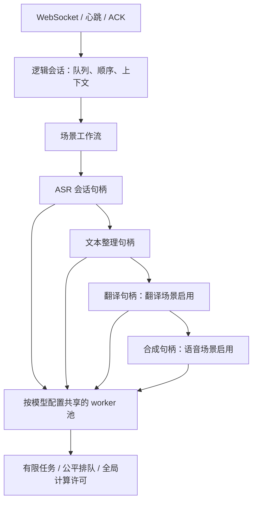

# 流式长会话与共享模型 worker

## 实现结构

`workflows.py` 定义三种场景的阶段组合、首输出类型及文本/语音编排器。`ports/streaming.py` 定义阶段与 worker 的抽象接口。编排器只使用处理计划、类型化结果及接口；模型构造、共享和原生进程生命周期位于推理适配器。

模型 worker 按模型 ID、阶段、线程配置复用；TTS 回退模型配置也是池键的一部分。语言方向、术语、语速、音色与在线 ASR 状态属于会话适配器实例。同一模型的原生调用串行排队，不让两个会话同时操作同一原生实例；不同模型可使用全局计算许可并行执行。worker 数量、驻留估算、等待任务和会话数各有边界。当前每种模型配置只有一个 worker，并非已实现任意横向副本或批推理。

ASR 是有状态在线推理：共享 recognizer/model，每个会话单独持有 stream、音频偏移、增益、修订号和上下文版本。有限音频任务必须按该会话的顺序交给持有其句柄的 worker。不能将在线解码状态当成可任意迁移的无状态任务。格式化、翻译、TTS 使用独立会话包装器共享模型；TTS 仅消费提交后的译文。

## 时长与资源

| 配置 | 默认 | 作用 |
|---|---:|---|
| `streaming_max_sessions` | 2 | 连接及会话状态边界，保持既有默认 |
| `streaming_compute_slots` | 2 | REST 与流处理共享的执行许可 |
| `streaming_max_model_workers` | 8 | 已缓存/正在使用的模型进程边界 |
| `streaming_memory_mib` | 4096 | 按模型配置累计的驻留估算，不是 RSS 限制 |
| `streaming_max_pending_jobs` | 32 | 每个模型 worker 的等待任务上限 |
| `streaming_worker_idle_seconds` | 60 | 无句柄使用的模型回收期限 |
| `streaming_idle_seconds` | 60 | PCM/显式心跳的连接活跃期限 |
| `streaming_lifetime_seconds` | 0 | 无默认墙钟硬上限；正数显式启用 |
| `streaming_max_audio_seconds` | 0 | 无默认累计音频上限；独立于墙钟 |

模型缓存持有模型使用租约，空闲回收或关服才释放。增加允许的会话时长不会预分配对应长度的音频；增加会话数量仍会增加有界 stream、缓冲和上下文内存。多个不同模型链路的合计预算可能超过 4096MiB，因此提高连接数不能保证任意混合方向都可准入。模型池不接受当前预算的新模型时明确返回 overload/admission 错误。

队列排空、原生调用和输出消费继续有截止时间。心跳只维持连接，不解除队列、计算或播放背压限制。后台浏览器被系统暂停时，心跳也可能停止。

## 上下文与容错

每个会话保存最近 3 个已提交语义单元，总计最多 512 字符；显式术语最多 64 项。动态缩略词候选有数量/有效期限制，版本随提交递增。ASR 在声学分段边界采用新快照。当前 greedy 模型不支持文本 prompt/hotword bias；能力声明保持为不支持，不能据此宣称识别质量改善。未来适配器通过 `update_context` 接入其原生能力，不能把未确认草稿或译文反馈写入源语历史。

正常取消和关闭释放当前会话句柄，健康共享进程继续服务其他会话。原生调用挂起或进程崩溃时，该模型的句柄失效并显式报告 `worker_lost`；重建要等受影响句柄释放。不会把旧句柄静默连到新模型进程。当前跨连接续传、ASR 状态迁移、跨进程 checkpoint 和已播音频去重恢复尚未实现；断线仍结束会话，重连创建新会话。

## 验证与边界

自动测试覆盖真实 spawned worker 的模型复用、会话状态隔离、等待取消、进程崩溃、原生超时、空闲回收和预算驱逐；协议测试覆盖心跳维持静默连接、独立音频时长限制。双向模拟阶段各输入 3600 个一秒块，检查最终文本/音频顺序、完整排空及历史上限。这是加速逻辑时长验证，不是实际一小时原生模型 soak。

本轮真实模型报告位于本地 `.smartvoice-dev/streaming-product/shared-pool-*.json`；关键结论整理在测试矩阵。小时级真实会议音频、8/16 会话新架构容量、完整进程树 RSS/CPU、后台/断线恢复及物理可听验收仍需独立证据。共享模型的结构收益不能替代容量和延迟实测。
